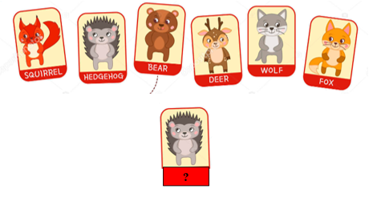
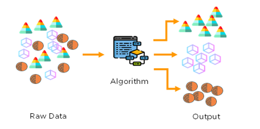
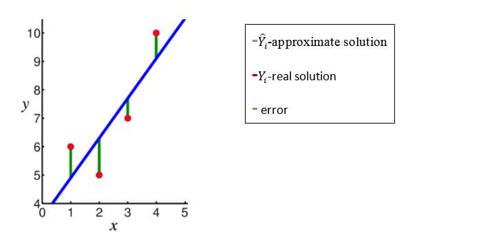

## Quick Intro

This course is an introduction machine learning basics theory and practice. Learning is a general word refers to decision making using previews knowledge. There are 3 different types of learning:

### Supervised learning
supervised learning is maybe the most common modern way of teaching. In this method some "Teacher" shows you an example
and you are required to repeat the example logic on some other examples.




### Unsupervised learning:

Unsupervised learning is a way to make Decisions based on correlation in the data.




### Reinforcement learning:

In this method the Decision is based on interaction with the environment. The learning is done using Trial and error. 


 


## Linear regression 

### Notations:

<p align="center"></p>


In linear regression we assume the connection between X and Y is linear:
 trying to fit  in order to achieve the lowest error.(we want to be as close as possible to )



```math
#### a^2+b^2=c^2
```

**Linear classifier.** In this module we will start out with arguably the simplest possible function, a linear mapping:

<p align="center"></p>


