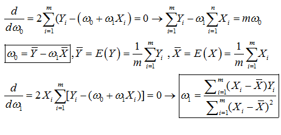
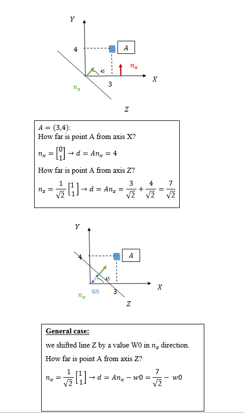
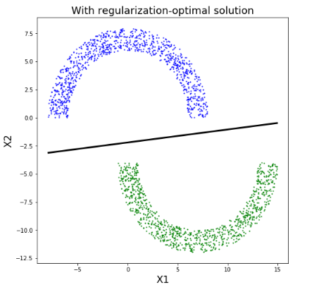

## Quick Intro

This course is an introduction machine learning basics theory and practice. Learning is a general word refers to decision making using previews knowledge. There are 3 different types of learning:

### Supervised learning
supervised learning is maybe the most common modern way of teaching. In this method some "Teacher" shows you an example
and you are required to repeat the example logic on some other examples.

### Unsupervised learning:

Unsupervised learning is a way to make Decisions based on correlation in the data.

### Reinforcement learning:

In this method the Decision is based on interaction with the environment. The learning is done using Trial and error. 

 

## Linear regression 

### Notations:

$$
\begin{align}
  & S=\left\{ \left( {{X}_{1}},{{Y}_{1}} \right),\ldots .,\left( {{X}_{m}},{{Y}_{m}} \right) \right\} \\ 
 & S=Training~data~ \\ 
 & {{X}_{i}}=input~i\left( image,voice,\ldots  \right)~~.~~{{Y}_{i}}=True~label\left( cat,''\text{hello }\!\!~\!\!\text{ siri''}... \right) \\ 
 & {{{\hat{Y}}}_{i}}=approximated~label \\ 
 & m-number~of~training~vecors~X \\ 
\end{align}
$$

In linear regression we assume the connection between X and Y is linear:
${{\hat{Y}}_{i}}={{\omega }_{1}}{{X}_{i}}+{{\omega }_{0}}$ trying to fit ${{\omega }_{1}},{{\omega }_{0}}$ in order to achieve the lowest error.(we want$~{{\hat{Y}}_{i}}$ to be as close as possible to ${{Y}_{i}}$)

In order to achieve the learning goal(${{\hat{Y}}_{i}}$ to be as close as possible to ${{Y}_{i}}$) we want to minimize the sum of all  – error as much as possible. 

#### The formulation is:

$argmi{{n}_{{{\omega }_{0}},{{\omega }_{1}}}}~\underset{i=1}{\overset{m}{\mathop \sum }}\,{{\left( {{Y}_{i}}-{{{\hat{Y}}}_{i}} \right)}^{2}}=\underset{i=1}{\overset{m}{\mathop \sum }}\,{{\left( {{Y}_{i}}-\left( {{\omega }_{0}}+{{\omega }_{1}}{{X}_{i}} \right) \right)}^{2}}$
	
The goal is to find ${{\omega }_{0}},{{\omega }_{1}}$that minimize the error.

#### Finding ${{\omega }_{0}},{{\omega }_{1}}$ that minimize this equation:

### Generalization:

Our main goal is to do well on the real world not on our training set S. 
Let’s assume the real world model is not a linear model but it's possible to draw a line such that
$\sum$errors(green lines) would be 0. in this case we can imagine the error as a independent variable with a
variance $\sigma$ and mean=0:

$\hat{Y}-Y=\epsilon$

#### such that:

$E(\hat{Y}-Y)=E(\epsilon)=0->E(hat{Y})=E(Y)$
$&\-E(\hat{\omega_1})=E(\omega_1)=\omega_1$
$&\-E(\hat{\omega_0})=E(\omega_0)=\omega_0$

#### Lets prove the equality for $\hat{\omega_0}$ and $\hat{\omega_1}$ holds:

$$
\begin{align}
  & E({{{\hat{\omega }}}_{1}})=E~\left( \frac{\mathop{\sum }_{i=1}^{m}({{X}_{i}}-\bar{X}){{{\hat{Y}}}_{i}}}{\mathop{\sum }_{i=1}^{m}{{({{X}_{i}}-\bar{X})}^{2}}} \right)=E~\left( \frac{\mathop{\sum }_{i=1}^{m}({{X}_{i}}-\bar{X})\left( {{Y}_{i}}+\epsilon  \right)}{\mathop{\sum }_{i=1}^{m}{{({{X}_{i}}-\bar{X})}^{2}}} \right) \\ 
 & \to E~\left( {{\omega }_{1}}+\frac{\mathop{\sum }_{i=1}^{m}({{X}_{i}}-\bar{X})\left( \epsilon  \right)}{\mathop{\sum }_{i=1}^{m}{{({{X}_{i}}-\bar{X})}^{2}}} \right)={{\omega }_{1}}+\frac{\mathop{\sum }_{i=1}^{m}({{X}_{i}}-\bar{X})E\left( \epsilon  \right)}{\mathop{\sum }_{i=1}^{m}{{({{X}_{i}}-\bar{X})}^{2}}}={{\omega }_{1}} \\ 
 &  \\ 
 & E({{{\hat{\omega }}}_{0}})=E\left( E\left( {\hat{Y}} \right)-{{\omega }_{1}}\bar{X} \right)=E\left( E\left( {{Y}_{i}}+\epsilon  \right)-{{\omega }_{1}}\bar{X} \right)={{\omega }_{0}} \\ 
\end{align}
$$

### General case:

Until now we only dealt with 2-dimension case Y=w1x+b This section goal is to generalize to n Dimensions :
$$
\[\begin{align}
  & Y=[{{Y}_{1}},{{Y}_{2}}....,{{Y}_{m}}] \\ 
 & X=[1,{{X}_{1}},{{X}_{2}}...,{{X}_{m}}] \\ 
 & \omega ={{[{{\omega }_{0}},{{\omega }_{1}}.....,{{\omega }_{m}}]}^{T}} \\ 
\end{align}\]
$$

#### The minimization equation is now:
$$
 & \arg \min {{\left( Y-\,\widehat{Y} \right)}^{2}}={{\left( Y-\,{{X}_{i}}\omega  \right)}^{2}} 
$$

#### Finding $\omega$ that minimize this equation:

$\[\frac{d}{d\omega }=2{{X}^{T}}\left( Y-X\omega  \right)=0\to \omega =\frac{{{X}^{T}}Y}{{{X}^{T}}X}\]$

## Perceptron

Our main goal is to find a linear separation rule for data that can be separated by a line:

### Geometrical explanation(line point distance):

This section provide neet explanation on how to compute distance between point and a line.

In general $<X,\hat{\omega}>+\omega_0 $=distance from line with normal  $\hat{\omega}$ and offset $\omega_0$

### Perceptron algorithm:
$$
\[\begin{align}
 & ~sample:~S=\left\{ \left( {{X}_{i}},{{Y}_{i}} \right),\ldots .\left( {{X}_{m}},{{Y}_{m}} \right) \right\} \\ 
 & ~intial~:{{\omega }^{\left( 1 \right)}}=\left\{ 0,0,\ldots ..,0 \right\} \\ 
 & \,\,\,\,for~t=1,2,3..: \\ 
 & \,\,\,\,\,\,\,\,\,for~i=1\to m:~~ \\ 
 & \,\,\,\,\,\,\,\,\,\,\,\,\,\,\,\,\,if~y\left\langle \omega ,x \right\rangle ~\le 0: \\ 
 & \,\,\,\,\,\,\,\,\,\,\,\,\,\,\,\,\,\,\,\,\,\,\,{{\omega }^{t+1}}={{\omega }^{t}}+{{y}_{i}}{{x}_{i}} \\ 
\end{align}\]
$$

#### Understanding perceptron update term:

After $ Y_i<\omega^t,x_i>\le 0 $(means wrong classification) we updated $\omega^{t+1}=\omega^t+y_ix_i $. 
Lets check how the new $\omega^{t+1}$ is doing on the $x_i,y_i$ example:

$$
\[{{y}_{i}}\left\langle {{\omega }^{t+1}},{{x}_{i}} \right\rangle ={{y}_{i}}\left\langle {{\omega }^{t}}+{{y}_{i}}{{x}_{i}},{{x}_{i}} \right\rangle ~=\underbrace{{{y}_{i}}<{{\omega }^{t}},{{x}_{i}}>}_{\le 0}+\underbrace{{{y}_{i}}{{y}_{i}}<{{x}_{i}},{{x}_{i}}>}_{always\,possitive}\to more\,positive\]
$$

#### Optimal soultion:

<table>
	<tr>
		<td>
				
		</td>
		<td>
			
		</td>
	</tr>
	
</table>
	
The optimal solution is defined has the solution which produce the highest margin. 
In order to find this optimal solution let's go back to our equation:

distance=$y_i<\hat{\omega},x_i>$ ->distance=$y_i<\frac{\omega}{||\omega||},x_i>$

We can see that the distance is dependent in ||$\omega$||. The lower ||$\omega$|| is the bigger the distance is.
From this we can derive the second perceptron role: argmin ||$\omega$||

####  Perceptron converges rule:

##### definitions: 
B=||$\omega*$||, R=max||$x_i$||
$\\ \omega*=argmin{||\omega|| s.t \, y_i<\hat{\omega},x_i> \geq 1 $
$\\ \omega^{1}=0$(intialization to 0)

##### proof:

Lets assume linear seperation is possible. We want to show that perceptron algorithm will stop after $(RB)^2 $ steps

In order to show that we wil proof that:
$\\ 1 \geq \frac{<\omega^{T+1},\omega*>}{||\omega^{T+1}||||\omega*||} \geq \frac{\sqrt(T)}{BR} $

The left inequality is simpile cause: 
$ \\\\ \frac{<\omega^{T+1},\omega*>}{||\omega^{T+1}||||\omega*||}=cos(\omega^{T+1},\omega*) \leq 1 $

The right inequality can be seperated to two inequalities:
##### (1) $ \, {<\omega^{T+1},\omega*>} \geq T $ proof:

The update term of the perceptron is:

$ \omega^{t+1}=\omega^{t}+x_iy_i $

In general we can write $\omega^{i}$:

$ \omega^{i}=omega^{1}+\sum\nolimits_{2}^{i} X_iy_i $

This means we can write $\omega^{T+1}$ as:

(P.1.1) $ \omega^{T+1}=omega^{1}+\sum\nolimits_{2}^{T+1} X_iy_i=\sum\nolimits_{2}^{T+1} X_iy_i $

Also by definition because $$\omega*$$ is the soultion and we assume linear seperation:

(P.1.2) $ <X_iy_i,\omega*> \geq 1 $

Using both (P.1.1)+(P.1.2) 

$ {<\omega^{T+1},\omega*>} =<\sum\nolimits_{2}^{T+1} X_iy_i,\omega*> \geq T $
 
(2)

