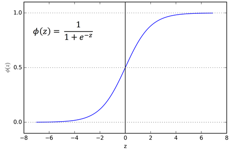
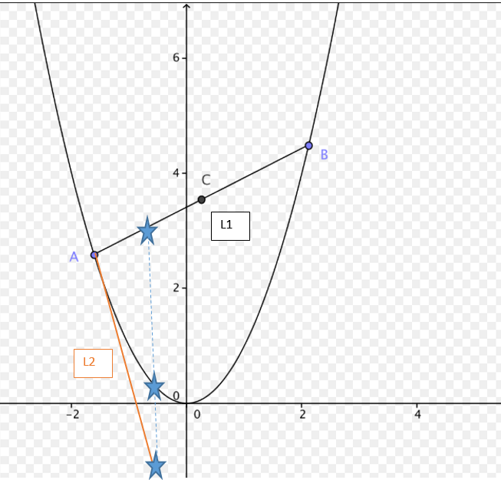
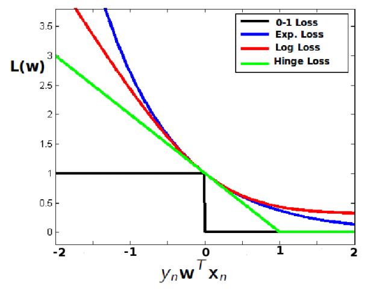
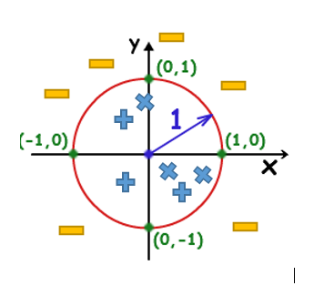
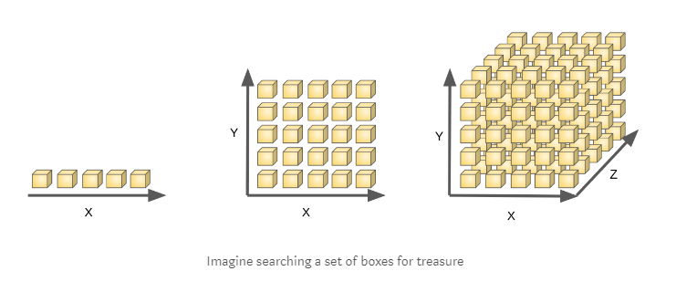
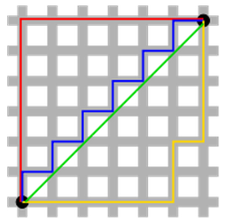

## Quick Intro

This course is an introduction machine learning basics theory and practice. Learning is a general word refers to decision making using previews knowledge. There are 3 different types of learning:

### Supervised learning
supervised learning is maybe the most common modern way of teaching. In this method some "Teacher" shows you an example
and you are required to repeat the example logic on some other examples.

	

### Unsupervised learning:

Unsupervised learning is a way to make Decisions based on correlation in the data.

	

### Reinforcement learning:

In this method the Decision is based on interaction with the environment. The learning is done using Trial and error. 

	

## Linear regression 

### Notations:

$$
\begin{align}
  & S=\left\{ \left( {{X}_{1}},{{Y}_{1}} \right),\ldots .,\left( {{X}_{m}},{{Y}_{m}} \right) \right\} \\ 
 & S=Training~data~ \\ 
 & {{X}_{i}}=input~i\left( image,voice,\ldots  \right)~~.~~{{Y}_{i}}=True~label\left( cat,''\text{hello }\!\!~\!\!\text{ siri''}... \right) \\ 
 & {{{\hat{Y}}}_{i}}=approximated~label \\ 
 & m-number~of~training~vecors~X \\ 
\end{align}
$$

In linear regression we assume the connection between X and Y is linear:
${{\hat{Y}}_{i}}={{\omega }_{1}}{{X}_{i}}+{{\omega }_{0}}$ trying to fit ${{\omega }_{1}},{{\omega }_{0}}$ in order to achieve the lowest error.(we want$~{{\hat{Y}}_{i}}$ to be as close as possible to ${{Y}_{i}}$)

	

In order to achieve the learning goal(${{\hat{Y}}_{i}}$ to be as close as possible to ${{Y}_{i}}$) we want to minimize the sum of all  – error as much as possible. 

#### The formulation is:

$argmi{{n}_{{{\omega }_{0}},{{\omega }_{1}}}}~\underset{i=1}{\overset{m}{\mathop \sum }}\,{{\left( {{Y}_{i}}-{{{\hat{Y}}}_{i}} \right)}^{2}}=\underset{i=1}{\overset{m}{\mathop \sum }}\,{{\left( {{Y}_{i}}-\left( {{\omega }_{0}}+{{\omega }_{1}}{{X}_{i}} \right) \right)}^{2}}$
	
The goal is to find ${{\omega }_{0}},{{\omega }_{1}}$that minimize the error.

#### Finding ${{\omega }_{0}},{{\omega }_{1}}$ that minimize this equation:

	

### Generalization:

Our main goal is to do well on the real world not on our training set S. 
Let’s assume the real world model is not a linear model but it's possible to draw a line such that
$\sum$errors(green lines) would be 0. in this case we can imagine the error as a independent variable with a
variance $\sigma$ and mean=0:

$\hat{Y}-Y=\epsilon$

#### such that:

$E(\hat{Y}-Y)=E(\epsilon)=0->E(hat{Y})=E(Y)$
$&\-E(\hat{\omega_1})=E(\omega_1)=\omega_1$
$&\-E(\hat{\omega_0})=E(\omega_0)=\omega_0$

#### Lets prove the equality for $\hat{\omega_0}$ and $\hat{\omega_1}$ holds:

$$
\begin{align}
  & E({{{\hat{\omega }}}_{1}})=E~\left( \frac{\mathop{\sum }_{i=1}^{m}({{X}_{i}}-\bar{X}){{{\hat{Y}}}_{i}}}{\mathop{\sum }_{i=1}^{m}{{({{X}_{i}}-\bar{X})}^{2}}} \right)=E~\left( \frac{\mathop{\sum }_{i=1}^{m}({{X}_{i}}-\bar{X})\left( {{Y}_{i}}+\epsilon  \right)}{\mathop{\sum }_{i=1}^{m}{{({{X}_{i}}-\bar{X})}^{2}}} \right) \\ 
 & \to E~\left( {{\omega }_{1}}+\frac{\mathop{\sum }_{i=1}^{m}({{X}_{i}}-\bar{X})\left( \epsilon  \right)}{\mathop{\sum }_{i=1}^{m}{{({{X}_{i}}-\bar{X})}^{2}}} \right)={{\omega }_{1}}+\frac{\mathop{\sum }_{i=1}^{m}({{X}_{i}}-\bar{X})E\left( \epsilon  \right)}{\mathop{\sum }_{i=1}^{m}{{({{X}_{i}}-\bar{X})}^{2}}}={{\omega }_{1}} \\ 
 &  \\ 
 & E({{{\hat{\omega }}}_{0}})=E\left( E\left( {\hat{Y}} \right)-{{\omega }_{1}}\bar{X} \right)=E\left( E\left( {{Y}_{i}}+\epsilon  \right)-{{\omega }_{1}}\bar{X} \right)={{\omega }_{0}} \\ 
\end{align}
$$

### General case:

Until now we only dealt with 2-dimension case Y=w1x+b This section goal is to generalize to n Dimensions :
$$
\[\begin{align}
  & Y=[{{Y}_{1}},{{Y}_{2}}....,{{Y}_{m}}] \\ 
 & X=[1,{{X}_{1}},{{X}_{2}}...,{{X}_{m}}] \\ 
 & \omega ={{[{{\omega }_{0}},{{\omega }_{1}}.....,{{\omega }_{m}}]}^{T}} \\ 
\end{align}\]
$$

#### The minimization equation is now:
$$
 & \arg \min {{\left( Y-\,\widehat{Y} \right)}^{2}}={{\left( Y-\,{{X}_{i}}\omega  \right)}^{2}} 
$$

#### Finding $\omega$ that minimize this equation:

$\[\frac{d}{d\omega }=2{{X}^{T}}\left( Y-X\omega  \right)=0\to \omega =\frac{{{X}^{T}}Y}{{{X}^{T}}X}\]$

## Perceptron

Our main goal is to find a linear separation rule for data that can be separated by a line:

	

### Geometrical explanation(line point distance):

This section provide neet explanation on how to compute distance between point and a line.

	

 

In general $<X,\hat{\omega}>+\omega_0 $=distance from line with normal  $\hat{\omega}$ and offset $\omega_0$

### Perceptron algorithm:
$$
\[\begin{align}
 & ~sample:~S=\left\{ \left( {{X}_{i}},{{Y}_{i}} \right),\ldots .\left( {{X}_{m}},{{Y}_{m}} \right) \right\} \\ 
 & ~intial~:{{\omega }^{\left( 1 \right)}}=\left\{ 0,0,\ldots ..,0 \right\} \\ 
 & \,\,\,\,for~t=1,2,3..: \\ 
 & \,\,\,\,\,\,\,\,\,for~i=1\to m:~~ \\ 
 & \,\,\,\,\,\,\,\,\,\,\,\,\,\,\,\,\,if~y\left\langle \omega ,x \right\rangle ~\le 0: \\ 
 & \,\,\,\,\,\,\,\,\,\,\,\,\,\,\,\,\,\,\,\,\,\,\,{{\omega }^{t+1}}={{\omega }^{t}}+{{y}_{i}}{{x}_{i}} \\ 
\end{align}\]
$$

#### Understanding perceptron update term:

After $ Y_i<\omega^t,x_i>\le 0 $(means wrong classification) we updated $\omega^{t+1}=\omega^t+y_ix_i $. 
Lets check how the new $\omega^{t+1}$ is doing on the $x_i,y_i$ example:

$$
\[{{y}_{i}}\left\langle {{\omega }^{t+1}},{{x}_{i}} \right\rangle ={{y}_{i}}\left\langle {{\omega }^{t}}+{{y}_{i}}{{x}_{i}},{{x}_{i}} \right\rangle ~=\underbrace{{{y}_{i}}<{{\omega }^{t}},{{x}_{i}}>}_{\le 0}+\underbrace{{{y}_{i}}{{y}_{i}}<{{x}_{i}},{{x}_{i}}>}_{always\,possitive}\to more\,positive\]
$$

#### Optimal soultion:

<table>
	<tr>
		<td>
				
		</td>
		<td>
			
		</td>
	</tr>
	
</table>
	
The optimal solution is defined has the solution which produce the highest margin. 
In order to find this optimal solution let's go back to our equation:

distance=$y_i<\hat{\omega},x_i>$ ->distance=$y_i<\frac{\omega}{||\omega||},x_i>$

We can see that the distance is dependent in ||$\omega$||. The lower ||$\omega$|| is the bigger the distance is.
From this we can derive the second perceptron role: argmin ||$\omega$||

####  Perceptron converges rule:

##### definitions: 
B=||$\omega*$||, R=max||$x_i$||
$\\ \omega*=argmin{||\omega|| s.t \, y_i<\hat{\omega},x_i> \geq 1 $
$\\ \omega^{1}=0$(intialization to 0)

##### proof:

Lets assume linear seperation is possible. We want to show that perceptron algorithm will stop after $(RB)^2 $ steps

In order to show that we wil proof that:
$\\ 1 \geq \frac{<\omega^{T+1},\omega*>}{||\omega^{T+1}||||\omega*||} \geq \frac{\sqrt(T)}{BR} $

**It's easy to see that $ /frac {sqrt(T)}{BR} \leq 1 $ is equivalent to $ T \leq RB^2 $

The left inequality is simpile cause: 
$ \\\\ \frac{<\omega^{T+1},\omega*>}{||\omega^{T+1}||||\omega*||}=cos(\omega^{T+1},\omega*) \leq 1 $

The right inequality can be seperated to two inequalities:
##### (1) $ \, {<\omega^{T+1},\omega*>} \geq T $ proof:

- The update term of the perceptron is:

	* $  \,\,\, \omega^{t+1}=\omega^{t}+x_iy_i $

- In general we can write $\omega^{i}$:

	* $ \omega^{i}=\omega^{1}+\sum\nolimits_{2}^{i} X_iy_i $

- This means we can write $\omega^{T+1}$ as:

	* (P.1.1) $ \omega^{T+1}=\omega^{1}+\sum\nolimits_{2}^{T+1} X_iy_i=\sum\nolimits_{2}^{T+1} X_iy_i $

- Also by definition because $\omega*$ is the soultion and we assume linear seperation:

	* (P.1.2) $ <X_iy_i,\omega*> \geq 1 $

- Using both (P.1.1)+(P.1.2) 

	* $ \,\,\, {<\omega^{T+1},\omega*>} =<\sum\nolimits_{2}^{T+1} X_iy_i,\omega*> \geq T $
 
#####  (2)  $ ||\omega^{T+1}||^2 \leq TR^2 $ proof:

  - $ ||\omega^{T+1}||^2=||\omega^{T}+xiy_i||^2 \leq ||\omega^{T}||^2 +||xiy_i||^2 (**Triangle-inequ) $
  
  	$ ||\omega^{T}||^2 +||xi||^2 \leq ||\omega^{T}||^2 +R^2 $
  
  - now we can do the same repeatedly for $||\omega^{T}||^2 $ until we get:
  
	* $ ||\omega^{T+1}||^2 \leq TR^2 $
  
#### (1)/(2):

* $ \frac{<\omega^{T+1},\omega*>}{||\omega^{T+1}||} \leq \frac{T}{\sqrt(T)R}$   | devide-by  $ ||\omega*||=B $ 

* $ \frac{<\omega^{T+1},\omega*>}{||\omega^{T+1}||||\omega*||} \geq \frac{\sqrt(T)}{BR}$
 

## Logistic regression:

The Perceptron rule <w,x> gave us distance which is between $[-\infty,\infty]$ when $\infty$ is far in the positive side and 
$-\infty$ is in the far in the negetive side. if we think about it the bigger the distance the more likely that
the classification is right when 0 is 50% to each side.

Insted of working in distances space we want to talk about chances or probability to be a part of a class given some x , p(y|x).
to do so we need to change our space from $[-\infty,\infty]$ to [0,1]. A very usefull function to do so is the sigmoid function:

	

The function in $\infty $ is 1(heigh probability) and 0(low probability) in $-\infty $

#### Classes probability:

$$ P(y_i=1|X)=\frac {1}{1+e^{-<\hat{\omega},x_i>}} $$

$$ P(y_i=-1|x_i)=1-P(Y=1|x_i)=\frac {1}{1+e^{<\hat{\omega},x_i>}} $$

So we can say in general that:

$$ P(y_i|x_i)=\frac {1}{1+e^{-y_i<\hat{\omega},x_i>}} $$

#### Finding the optimal $\omega$:

We can use maximum likelihood estimation method to find $\omega$ that will maximize the probability:

$$ P(y_1,y_2...y_m|x_1,x_2...x_,)=\prod\limits_{i=1}^{m} \frac {1}{1+e^{-y_i<\hat{\omega},x_i>}} $$

because log is monotonic increasing function we can maximize log(P(y_1,y_2...y_m|x_1,x_2...x_,))

$$maximize \, \sum\limits_{i=1}^{m} log(\frac {1}{1+e^{-y_i<\hat{\omega},x_i>}}) $$

This is same as:

$$minimize \, \sum\limits_{i=1}^{m} log({1+e^{-y_i<\hat{\omega},x_i>})  $$

This equation is called log-loss loss function. while we already saw the mean square root loss: 

$$minimize \, \sum\limits_{i=1}^{m} ({y_i-<\hat{\omega},x_i>})^2  $$

This loss gives use the probability result between [0,1]

## SVM:

In general there is not much diffrent between SVM and perceptron in practice. both in the end try to minimize a form of this equation: 
$\\ \omega*=argmin{||\omega|| s.t \, y_i<\hat{\omega},x_i> \geq 1 $

SVM consept is much closer to optimization approach(we have seen somthing similar in Logistic regression):

- build a convex function with parameter $\omegea$

- minimize this function using gradient methods(gradient descent, newton method, conjugate gradient...)

- find optimal solution

### convex functions properies:

	

Has seen in the image a convex function is defined such that:

(1) line connects two points on the function will always be above the function(black line).

(2) points on the tangent Line are below the function(orange line). 

mathematically this two conditions can be written:

Line between A and B(black line) is = $\lambda X_b +(1-\lambda) X_a, \lambda=[0,1] $

(1) $f_{convex}(black Line) \leq black Line $

orange line = $ f'_{convex}(A)(x-A)+f_{convex}(A) $

(2) $f_{convex}(orange Line) \geq orange Line $

### convex loss functions:

	

We already saw some of the functions:

- 0-1 loss if $y_i<\hat{\omega},x_i> \leq 0, 1: 0 otherwise $

- perceptron loss:  $max (0,y_i<\hat{\omega},x>) $

- Hindge loss(perceptron with 1 as margin):  $max (0,1-y_i<\hat{\omega},x>) $

- log loss(perceptron with 1 as margin):  $ log({1+e^{-y_i<\hat{\omega},x_i>})) $

### convexity proof:

#### Hindge loss and perceptron:

both perceptron and the hindge loss are sum of two linear functions one with zero slope and one with a slope off 1. 
a linear function is by definition convex and a sum of convex functions is convex.

#### Log loss convexity:

if $f''(x) \geq 0 $ then function is convex.

$f''(x)= \frac {e^(x)}{(e^(x)+1)^2} \geq 0 $

### Non linear seperation SVM:

We can create nun linear lines easily by just choosing the right features(x) to work with. 

example:

	

We want to seperate the +/- and our features is x1=x,x2=y easy to see that linear classification 
in a form of $\omega_2 x_1 +\omega_1 x_2 +\omega_0 $ will do poorly.
from the picture it's easy to see that a circle with radius 1 is the best solution:
$x_1^2+x_2^2=1$ or in classification role $ -: x_1^2+x_2^2-1>0 ,/ +: other  $ .

In order to solve this problem lets choose new features $x1=x^2,x2=y^2$ 

now we have a linear classification problem:

 $minmize (max (0,1-y_i<\hat{\omega},x>)) $

We can generlize this to any elipse  $x1=x^2,x2=y^2,x3=xy,x1=x,y4=y$ 

We can generlize it to any polynomial $x1=x,x2=x^2,x3=x^3...$ 

The feature selection is called the kernal of the system.

### Regularization term:

We have seen regularization term before minimize $ ||\omega ||$. We have also prooved that in the perceptron
role this condition increase the margin to optimal solution. 

In general: The more features the more our equation is complex, we simply cannot comprehensively sample all the possible combinations, leaving vast regions of feature space in the dark. This problem is called the curse dimensionality.
The regularization term goal is to cancell unnecessary or correlated features leaving us with smaller region to search.

	

#### <a href="https://medium.freecodecamp.org/the-curse-of-dimensionality-how-we-can-save-big-data-from-itself-d9fa0f872335/">further reading</a> 

#### L1 and L2 Regularization terms:

- L1(Lasso regression): $ \lambda \sum |\omega_j| $

- L2(Lasso regression): $ \lambda \sum \omega_j^2 $

comparison:

	

The green line (L2-norm) is the unique shortest path, while the red, blue, yellow (L1-norm) are all same length (=12) for the same route. Generalizing this to n-dimensions. This is why L2-norm has unique solutions while L1-norm does not.

#### Notes:

##### Sparsity:

L2 minimization will minmize all $\omega$ while L1 will create realy small-zero $\omega$  and very large $\omega$ .

example:

L2-  $\omega =(\frac{3}{2},\frac{3}{2})$---better solution then---- $\omega=(3,0)$

L1-  $\omega =(\frac{3}{2},\frac{3}{2})$--------equally good-------- $\omega=(3,0)$ 

#### <a href="http://www.chioka.in/differences-between-l1-and-l2-as-loss-function-and-regularization/">further reading</a> 

### SVM final form

#### build a convex function with parameter $\omegea$

We already showed convexity to the log-loss,hindge-loss and perceptron. The L1(linear function),L2(quadratic function) Regularization terms are also convex. By definition(derivation is a linear operator) some of two convex function is also convex. We can write an optimization rule subjected to equality constraints(Lagrange multiplier):

