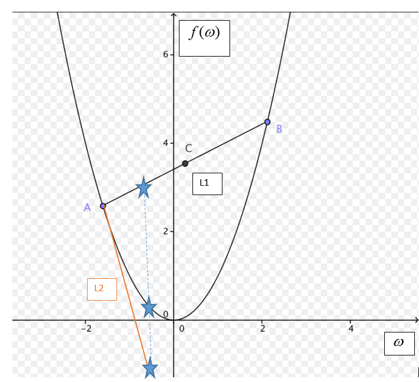

#### Stochastic gradient descent vs batch gradient descent

The question is how ofen $\omega_(t+1)=\omega_t \eta \nabla J $ is done.

- Stochastic gradient descent  J is computed every sample J=L.

- batch gradient descent J is computed after going over all samples J=E(L)

##### Why to differ one over the other:  

In very large data sets saving X and $\omega $ vectors or matrix can occupy large junk of your allocation memory. In addition Stochastic gradient descent(SGD) widely use for online learning. on the other hand, batch gradient descent optimization rule is much smoother. usually today the combination of the two is used taking batches equal to $2^n$ samples.
 
##### perceptron vs SVM

Perceptron is a private solution of SVM. 
SVM using: SGD, hindge loss, L2 regularization, $\lambda=frac{1}{2}$, $\eta =1$ is eqvivalent to perceptron.

In this case:
- J= $\lambda \sum \omega^2+max(0,1-y_i<\omega,x_i>$)
- for $y_i<\omega,x_i> <1 $ : 
 * $ \nabla J =\sum\omega-y_i x_i $
 * $ \omega_{t+1}=\omega_{t}+y_i x_i-\sum \omega $

### SVM convergence Proof:

There are many proofs that convex function can be optmized to global minimum. We also proofed convergence in perceptron and showed the maximum number of steps to convergence is $(RB)^2 $ which is eqvivalent to SGD with hindge loss and L2 regularization.
In this section we want to find the number of steps to conveges in general case.

#### Assumption:

- f is convex.
- ||$\nabla f || \leq \rho $    # caled lipschitz law
- $ \omega * =argmin f(\omega) \,\, s.t \,\, ||\omega * || \leq \beta $

##### notations:

$V_i= \nabla f $ -update step in step i.

#### Goal:

We want to show that after T steps of gradient descent with $\eta=\frac{\beta}{\rho \sqrt(T)} $:

$ f(\bar {\omega}) -f(\omega* ) \leq \frac{\beta}{\rho \sqrt(T)} $

$ \bar {\omega} = \frac{1}{T} \sum \omega_t $

We look on $\bar{\omega } \,\, because \,\, \omega$ will almost never achive minimum $ \omega* $ but will bounce around the minimum dependent on size of $\eta$.

#### Proof:

	

##### step 1:

Using the 2 propertie of convex functions(orange line(g) always bellow the convex function):

- g(\omega*) = f(\omega_t)+\nabla f(\omega_t)(\omega*-\omega_t) $
- f(\omega*) \geq g(\omega*)= f(\omega_t)+\nabla f(\omega_t)(\omega*-\omega_t)$
-  $ <\omega_t-\omega*,\nabla f(\omega_t)> \geq f(\omega*)-f(\omega_t) $
  
  
